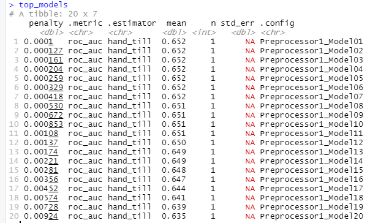
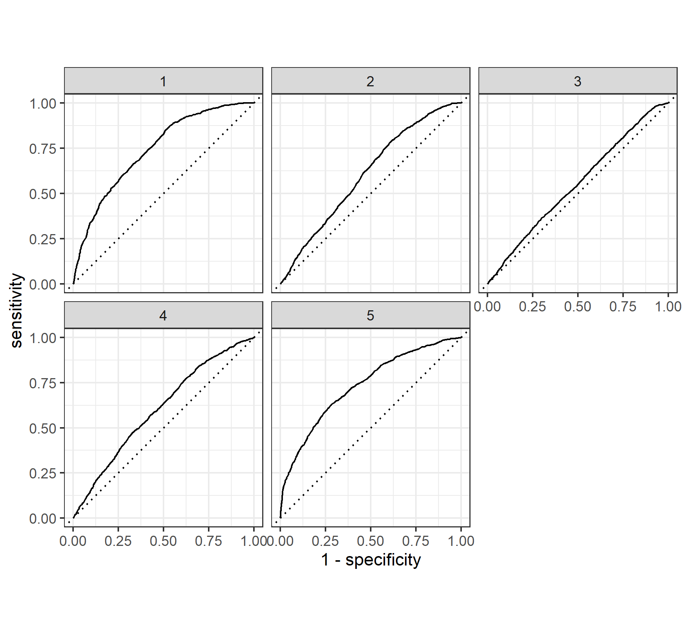
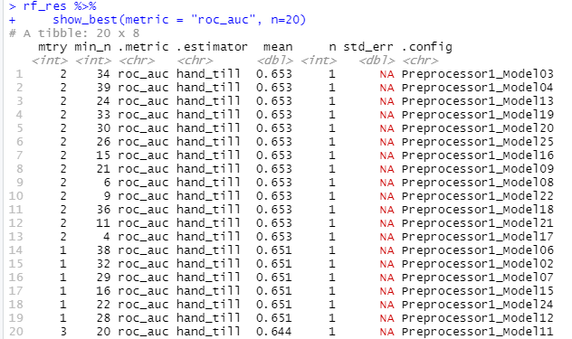
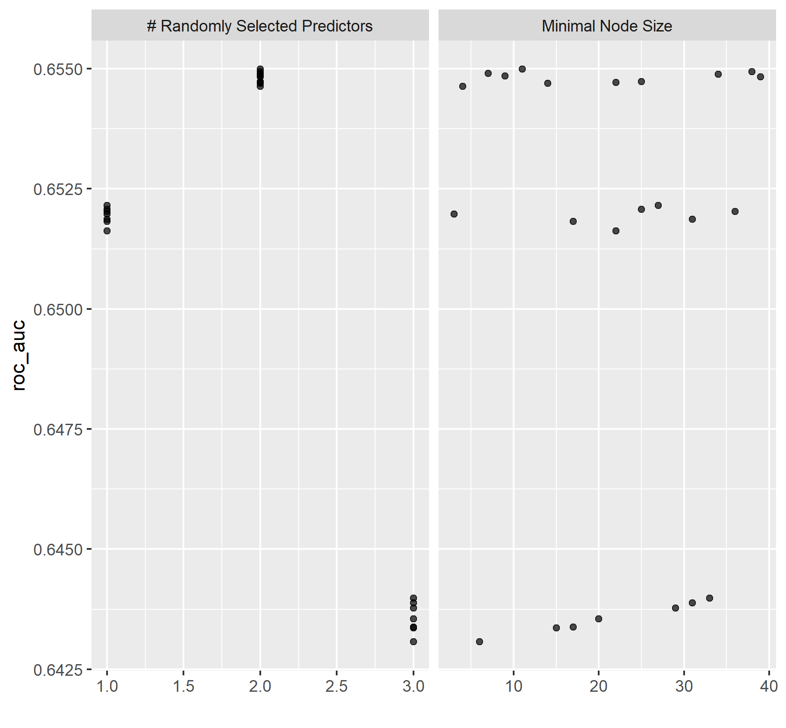
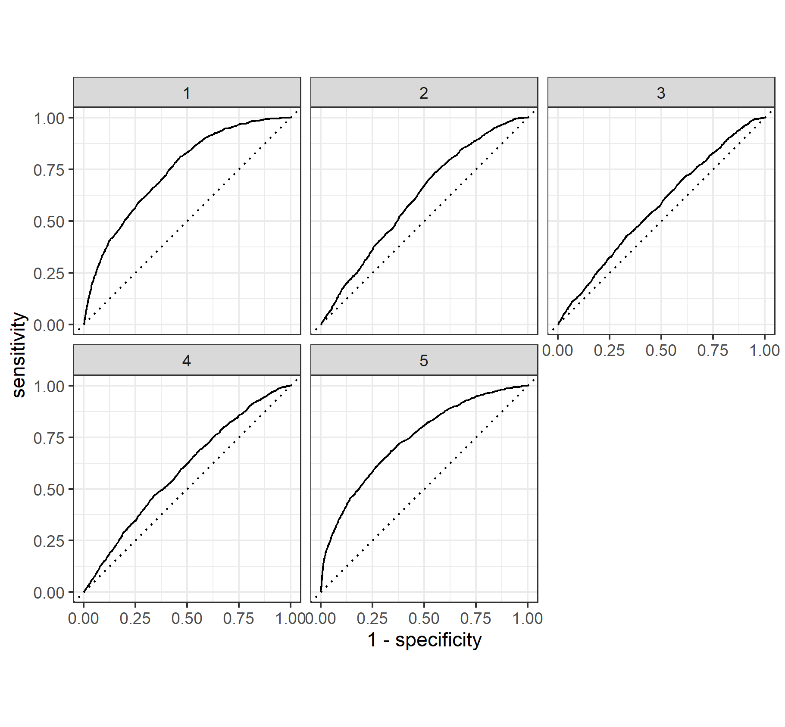
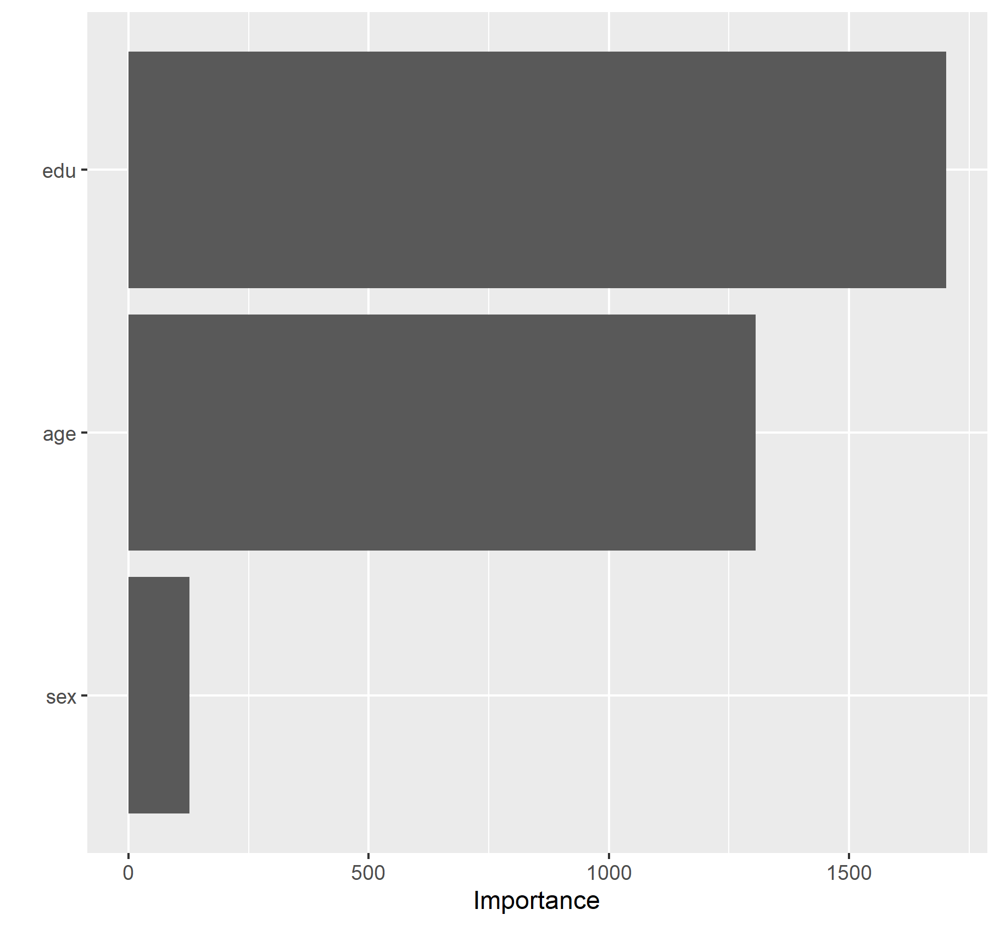

# Project Cameroon

### Using the R script provided, split and sample your DHS persons data and evaluate the AUC - ROC values you produce. Which "top_model" performed the best (had the largest AUC)? Are you able to use the feature selection penalty to tune your hyperparameter and remove any potentially irrelevant predictors? Provide justification for your selected penalty value? 

As you can see from the graph below models 1 through 12 had the highest AUCs in the range 0.652 - 0.650. I chose model 11 because it has a higher penalty value along with a high AUC. Any of the values in this range could be used since the differences are so minute. Technically the model with the highest AUC is model 1 but the penalty is extremely high which would reduce the importance of variables way too much in exchange for a marginal increase in the AUC.

### Finally, provide your ROC plots and interpret them. How effective is your penalized logistic regression model at predicting each of the five wealth outcomes.

The model is very good at predicting wealth outcomes of 1 and 5. When it comes to predicting wealth outcomes of 2 and 4 it isn't terrible but there is room for improvement. Finally the model is very bad at predicting wealth outcomes of 3.
I found this odd because wealth class 3 possess the most observations compared to the other wealth classes. Therefore it might be that the variables used to predict wealth outcome 3 do not capture enough dimensionality required to make an accurate prediction for this wealth class.

### Using the R script provided, set up your random forest model and produce the AUC - ROC values for the randomly selected predictors, and the minimal node size, again with wealth as the target. How did your random forest model fare when compared to the penalized logistic regression? Provide your ROC plots and interpret them.

### Are you able to provide a plot that supports the relative importance of each feature's contribution towards the predictive power of your random forest ensemble model?

### Using the python script provided, train a logistic regression model using the tensorflow estimator API and your DHS data, again with wealth as the target.

### Apply the linear classifier to the feature columns and determine the accuracy, AUC and other evaluative metrics towards each of the different wealth outcomes.

### Then continue with your linear classifier adding the derived feature columns you have selected in order to extend capturing combinations of correlations (instead of learning on single model weights for each outcome).

### Again produce your ROC curves and interpret the results.

### Using the python script provided, train a gradient boosting model using decision trees with the tensorflow estimator. 

### Provide evaluative metrics including a measure of accuracy and AUC. 

### Produce the predicted probabilities plot as well as the ROC curve for each wealth outcome and interpret these results.

### Analyze all four models. 

### According to the evaluation metrics, which model produced the best results? 

### Were there any discrepancies among the five wealth outcomes from your DHS survey dataset?
