# Project Cameroon

# Model 1

### Using the R script provided, split and sample your DHS persons data and evaluate the AUC - ROC values you produce. Which "top_model" performed the best (had the largest AUC)? Are you able to use the feature selection penalty to tune your hyperparameter and remove any potentially irrelevant predictors? Provide justification for your selected penalty value? 

As you can see from the graph below models 1 through 12 had the highest AUCs in the range 0.652 - 0.650. I chose model 11 because it has a higher penalty value along with a high AUC. Any of the values in this range could be used since the differences are so minute. Technically the model with the highest AUC is model 1 but the penalty is extremely high which would reduce the importance of variables way too much in exchange for a marginal increase in the AUC.

Below is a graph of the AUC values of the penalized logistic regression

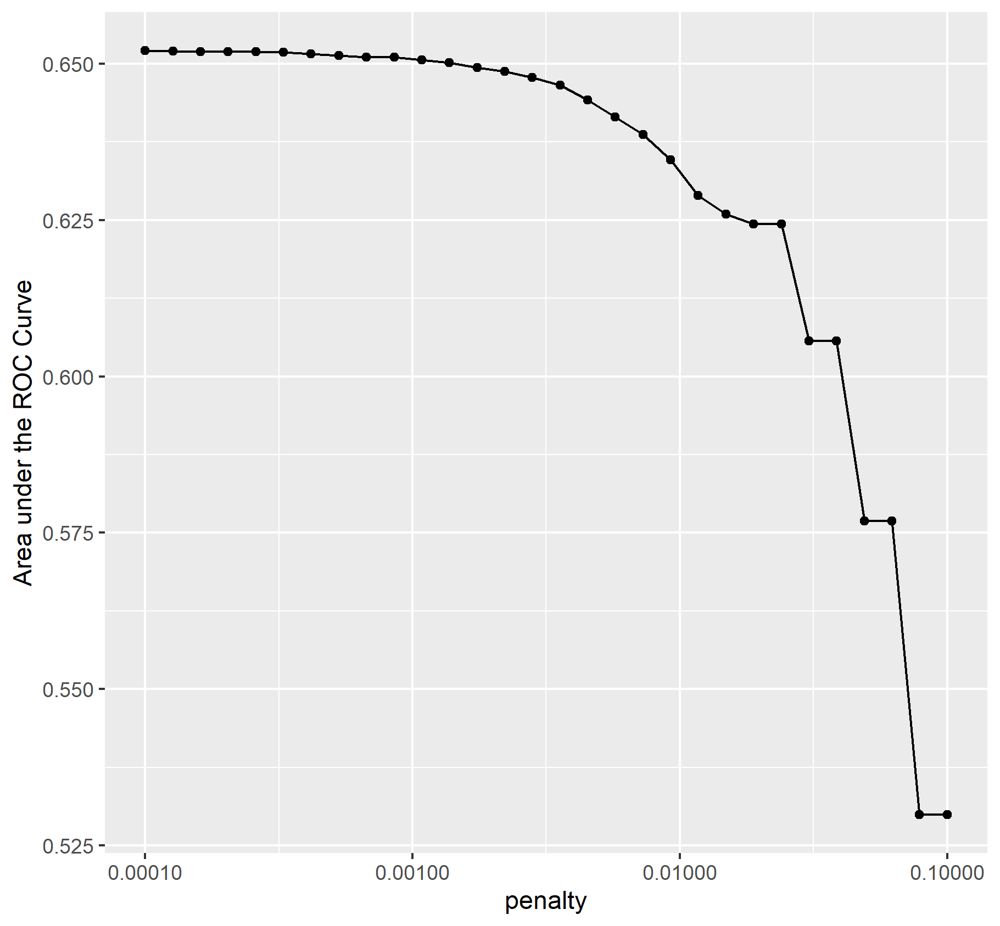

### Finally, provide your ROC plots and interpret them. How effective is your penalized logistic regression model at predicting each of the five wealth outcomes.

The model is very good at predicting wealth outcomes of 1 and 5. When it comes to predicting wealth outcomes of 2 and 4 it is pretty bad but still okay and there is much room for improvement. Finally the model is very bad at predicting wealth outcomes of 3.
I found this odd because wealth class 3 possess the most observations compared to the other wealth classes. Therefore it might be that the variables used to predict wealth outcome 3 do not capture enough dimensionality required to make an accurate prediction for this wealth class.

# Model 2

### Using the R script provided, set up your random forest model and produce the AUC - ROC values for the randomly selected predictors, and the minimal node size, again with wealth as the target. How did your random forest model fare when compared to the penalized logistic regression? Provide your ROC plots and interpret them.

#### Chart of min_n values.

#### Graph of randomly selected predictors and node sizes

#### Random Forest ROC Graphs

When compared to the penalized logistic regression, the performance of the two models is very similar. Once again the model is very good at predicting wealth outcomes of 1 and 5 and marginally acceptable when predicting wealth outcomes of 2 and 4. The ROC for wealth outcome 3 was slightly better in the random forest model.

### Are you able to provide a plot that supports the relative importance of each feature's contribution towards the predictive power of your random forest ensemble model?

From this plot we can tell that education is the most important feature.

# Model 3 

### Using the python script provided, train a logistic regression model using the tensorflow estimator API and your DHS data, again with wealth as the target. Apply the linear classifier to the feature columns and determine the accuracy, AUC and other evaluative metrics towards each of the different wealth outcomes. Then continue with your linear classifier adding the derived feature columns you have selected in order to extend capturing combinations of correlations (instead of learning on single model weights for each outcome). Again produce your ROC curves and interpret the results.

At first glance it seems that the accuracy for the logistic regression is much better for predicting every wealth class when setting one wealth class equal to 3 others so that there are only 2 unique classes. It is hard to tell if the overall accuracy improved given that we now have 5 separate models with separate AUCs. So to determine if the average accuracy improved by using this approach I calculated the average AUC across the individual wealth class results and it turns out that the total average AUC decreased which means that this approach failed to beat the penalized logstic regression. The average AUC here was 0.633337 compared to 0.65.

### Results for logistic regression wealth class 5 and ROC
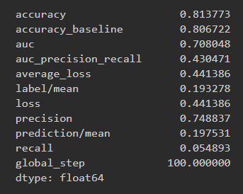
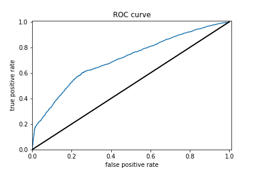

### Results for logistic regression wealth class 4 and ROC
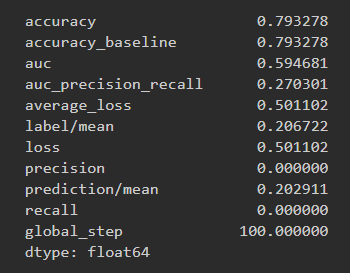
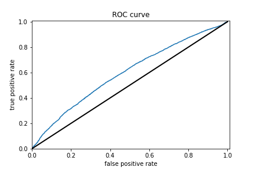

### Results for logistic regression wealth class 3 and ROC
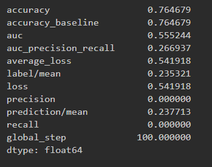
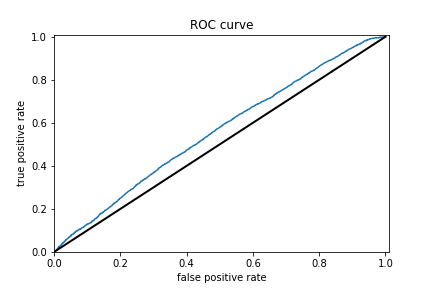

### Results for logistic regression wealth class 2 and ROC
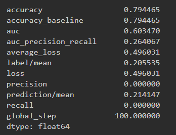
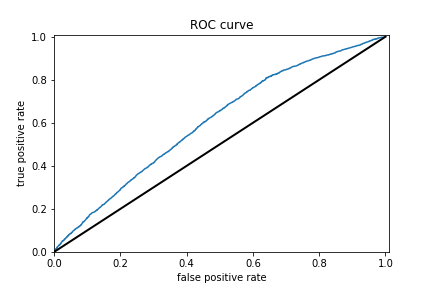

### Results for logistic regression wealth class 1 and ROC
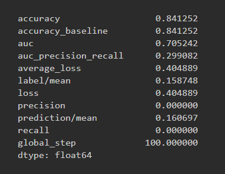
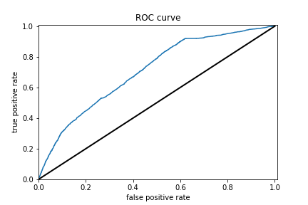

# Model 4

### Using the python script provided, train a gradient boosting model using decision trees with the tensorflow estimator. Provide evaluative metrics including a measure of accuracy and AUC. Produce the predicted probabilities plot as well as the ROC curve for each wealth outcome and interpret these results.

The boosted trees model achieved an AUC of 0.748843, which means it did better than random chance as well as all the other models. However 0.74 is still very far from 1 so room for improvement is there.

### Results for boosted trees wealth class 5 and ROC
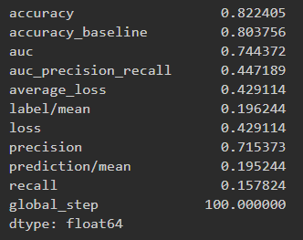
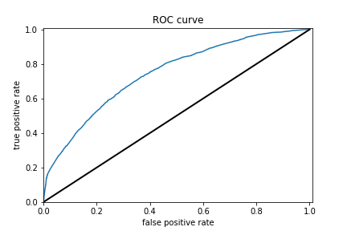

### Results for boosted trees wealth class 4 and ROC
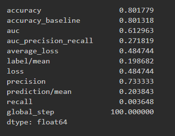
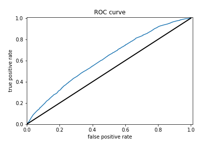

### Results for boosted trees wealth class 3 and ROC
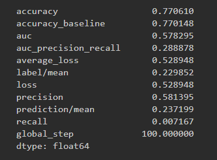
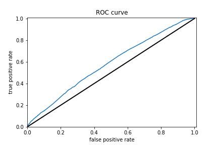

### Results for boosted trees wealth class 2 and ROC
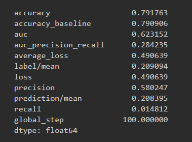

### Results for boosted trees wealth class 1 and ROC
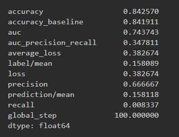
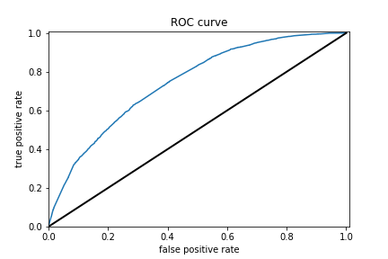

### Analyze all four models. According to the evaluation metrics, which model produced the best results? 

Going off of the AUC we see that the gradient boosting decision trees produced the best result with an AUC of 0.74 which is about 0.09 higher than the penalized logistic regression model.

### Were there any discrepancies among the five wealth outcomes from your DHS survey dataset?
I think the predictive power of the models to predict the individual wealth outcomes ought to have been the same however 

